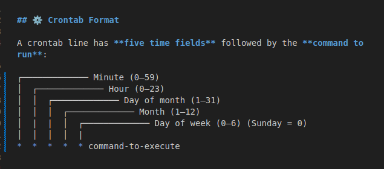

# Linux-Basics
This repository is my personal Linux learning log and cheat sheet. It contains simple notes, commands, and examples that I'm practicing while learning the Linux operating system.

The goal is to keep everything short, clear, and easy to reference, like a quick guide for students and beginners.

## Goals
- Learn basic terminal commands
- Write shell scripts
- Configure a web server
- Document progress and commands

## How I work
Each day I create a short log entry under `logs/` with the date and what I practiced.

## Quick commands used
- `sudo apt update && sudo apt upgrade`
- `git clone <repo>`
- `ssh user@host`
- `nano|vim|code .`

## Progress
- 2025-10-02: Created repo, set up VM, installed VS Code.

# Linux Learning Lab

## 🌍 What is Linux?
Linux is an open-source operating system that powers most of the world’s servers, cloud systems, and even Android phones. Unlike Windows or macOS, Linux is free, customizable, and heavily used in software engineering, DevOps, cybersecurity, and system administration.  

It’s built around the **Linux kernel**, which controls the hardware, and comes in many distributions (like Ubuntu, CentOS, Fedora, and Debian).  

## 🔧 Uses of Linux OS
Linux is widely used because of its stability, flexibility, and security. Some common uses are:
- **Servers & Cloud**: Powers websites, databases, and cloud platforms (AWS, Google Cloud, Azure).  
- **Software Development**: Programming, DevOps pipelines, and automation.  
- **Cybersecurity & Networking**: Used in penetration testing (Kali Linux) and firewalls.  
- **Embedded Systems**: Runs on devices like routers, smart TVs, and IoT gadgets.  
- **Everyday Computing**: Desktop distributions like Ubuntu for personal use.  
- **Mobile**: Android is built on the Linux kernel.  

## 🏗️ Components of Linux and Their Functions
1. **Kernel** → The core of Linux, manages hardware, processes, memory, and devices.  
2. **Shell** → Command-line interpreter (e.g., Bash, Zsh) that lets users communicate with the kernel.  
3. **File System** → Organizes data in directories and files (everything in Linux is treated as a file).  
4. **System Libraries** → Provide standard functions for programs (like `glibc`).  
5. **System Utilities** → Basic tools (like `ls`, `cp`, `mv`) to manage the system.  
6. **Applications** → Software installed on Linux (like VS Code, browsers, servers).  

# 📖 Linux Command Cheat Sheet (DevOps Focus)

Here are the most widely used Linux commands, grouped into 11 categories:

### ========================
### 1. SYSTEM INFORMATION
### ========================
`uname -a`        # Show system and kernel

`hostname`        # Show system hostname

`uptime`          # Show system uptime

`df -h`           # Disk usage

`free -m`         # Memory usage

`top`             # Running processes

### ========================
### 2. NAVIGATION
### ========================
`pwd`             # Print working directory

`ls`              # List files

`cd /path`        # Change directory

`cd ..`           # Go up one directory

`tree`            # Show directories as a tree

### ========================
### 3. FILE OPERATIONS
### ========================
`touch file.txt`             # Create a new file

`cat file.txt`                # Show file content

`cp file.txt backup.txt`      # Copy file

`mv file.txt /tmp/ `          # Move file

`rm file.txt`                 # Remove file

### ========================
### 4. FILE PERMISSIONS
### ========================
`ls -l`                       # List permissions

`chmod 755 file.txt`          # Change permissions

`chown user:group file.txt`   # Change owner

`umask`                       # Show default permissions

### ========================
### 5. USER & GROUP MANAGEMENT
### ========================
`whoami`                      # Current user

`id`                          # Show user/group IDs

`adduser newuser`            # Add a new user

`passwd newuser`              # Set user password

`groups`                     # Show groups

### ========================
### 6. TEXT PROCESSING
### ========================
`cat file.txt `               # View file content

`less file.txt `              # Scroll through file

`grep "word" file.txt`        # Search text in file

`sort file.txt `              # Sort file content

`wc -l file.txt `             # Count lines in file

#### ========================
### 7. PROCESS MANAGEMENT
### ========================
`ps aux`                      # Show running processes

`top`                         # Monitor processes

`kill -9 PID`                # Kill a process

`jobs`                        # Show background jobs

`fg `                         # Bring job to foreground

### ========================
### 8. PACKAGE MANAGEMENT (Ubuntu/Debian)
### ========================
`sudo apt update `            # Update package list

`sudo apt upgrade `           # Upgrade packages

`sudo apt install pkg`        # Install package

`sudo apt remove pkg`        # Remove package

`dpkg -l`                     # List installed packages

### ========================
### 9. NETWORKING
### ========================
`ping google.com `            # Test connectivity

`ifconfig `                   # Show network interfaces

`ip addr show `              # Show IP addresses

`netstat -tuln `              # Show open ports

`curl http://example.com `    # Fetch URL

### ========================
### 10. COMPRESSION & ARCHIVING
### ========================
`tar -cvf archive.tar files/` # Create tar archive

`tar -xvf archive.tar`        # Extract tar archive

`gzip file.txt `              # Compress file

`gunzip file.txt.gz `         # Decompress file

### ========================
### 11. SYSTEM CONTROL
### ========================
`shutdown -h now `            # Shutdown immediately

`reboot`                      # Reboot system

`systemctl status service`    # Show service status

`systemctl start service `    # Start service

`systemctl stop service `     # Stop service

## 🗂️ Linux File System Hierarchy — Study Summary

The **Linux File System Hierarchy** defines how files and directories are organized on a Linux system.  
Everything in Linux is treated as a **file** — even hardware devices and processes.

At the top of the structure is the **root directory `/`**, which contains all other files and folders in a tree-like structure.

###  Top-Level Directories

| Directory | Description |
|------------|-------------|
| `/` | The **root directory** — everything starts here. It’s the base of the Linux file system tree. |
| `/bin` | Essential **user binaries** (programs) needed for the system to boot and run, such as `ls`, `cp`, `mv`, `cat`. |
| `/boot` | Contains files required for **booting the system**, including the Linux kernel (`vmlinuz`) and bootloader configuration (`grub`). |
| `/dev` | Contains **device files** — these represent hardware devices like disks (`/dev/sda`), terminals, and USBs. |
| `/etc` | System-wide **configuration files** for software and services. Example: `/etc/passwd`, `/etc/hosts`. |
| `/home` | Each user’s **personal directory**. Example: `/home/sarah` stores personal files, downloads, and configs. |
| `/lib`, `/lib64` | Essential **shared libraries** needed by system programs and the kernel. Similar to DLL files in Windows. |
| `/media` | Used to **mount external drives** (USBs, CDs, DVDs) automatically. |
| `/mnt` | A **temporary mount point** for manually mounted devices or partitions. |
| `/opt` | Used for **optional or third-party software** (e.g., apps installed outside the package manager). |
| `/proc` | A **virtual directory** that provides information about system and process status in real-time. Example: `/proc/cpuinfo`. |
| `/root` | The **home directory for the root (admin) user** — different from `/`. |
| `/run` | Stores **runtime data** like system information since boot. |
| `/sbin` | System binaries used by the **root user** for administrative tasks (e.g., `ifconfig`, `reboot`). |
| `/srv` | Contains **service data** for servers like FTP, HTTP, and databases. |
| `/sys` | Provides system and device information — used by the kernel and hardware drivers. |
| `/tmp` | Temporary files created by users or processes. Cleared after reboot. |
| `/usr` | Stands for **Unix System Resources**. Contains user programs, libraries, documentation, and utilities. |
| `/var` | Holds **variable data** like logs, emails, databases, and caches. Example: `/var/log/syslog`. |

### 🧩 Simplified Analogy

Think of Linux like a **house**:

| Linux Directory | Analogy |
|------------------|---------|
| `/` | 🏠 The entire property (foundation) |
| `/home` | 🛏️ Your personal bedroom |
| `/etc` | ⚙️ The control panel (settings) |
| `/bin` | 🧰 Everyday tools |
| `/var/log` | 📹 CCTV recordings (system logs) |
| `/dev` | 🔌 Electrical wiring and plumbing (hardware) |

### 🌲 Linux Directory Structure Diagram

/  
├── **bin/** → Essential user binaries  
├── **boot/** → Bootloader and kernel files  
├── **dev/** → Device files  
├── **etc/** → System configuration files  
├── **home/** → User home directories  
│&nbsp;&nbsp;&nbsp;&nbsp;├── sarah/  
│&nbsp;&nbsp;&nbsp;&nbsp;└── guest/  
├── **lib/** → Shared libraries  
├── **media/** → Removable media  
├── **mnt/** → Temporary mount point  
├── **opt/** → Optional software  
├── **proc/** → Kernel and process info  
├── **root/** → Root user's home directory  
├── **run/** → Runtime data  
├── **sbin/** → System binaries for root  
├── **srv/** → Service data (web, FTP, etc.)  
├── **sys/** → Kernel and hardware information  
├── **tmp/** → Temporary files  
├── **usr/** → User programs, documentation, and libraries  
│&nbsp;&nbsp;&nbsp;&nbsp;├── bin/  
│&nbsp;&nbsp;&nbsp;&nbsp;├── lib/  
│&nbsp;&nbsp;&nbsp;&nbsp;└── share/  
└── **var/** → Logs, mail, cache, and databases

### 🔍 Key Notes

- The **root (`/`) directory** is not the same as `/root`.  
  - `/` is the entire system’s top level.  
  - `/root` is the root user’s personal directory.  
- Linux is **case-sensitive**: `/Home` ≠ `/home`.  
- Use **absolute paths** (`/etc/passwd`) for system operations.  
- Access rights are controlled by **permissions and ownership**.

---

### 🧠 Quick Recap

| Concept | Summary |
|----------|----------|
| Everything is a file | Devices, directories, and data are treated the same way. |
| Hierarchical structure | Starts from `/` and branches into subdirectories. |
| Organized by purpose | Each directory has a defined function. |
| Root privileges | Only the root user can modify system-level files. |

Tips: 
#Practice Commands
List directories under root
ls /

 View contents of /etc
ls -l /etc

Check your current directory
pwd

Move into a directory
cd /home

Move one level up
cd ..

## 📝 Linux Text Editors — Study Summary

Text editors are essential tools in Linux for **creating and modifying text files**, such as configuration files, scripts, and code.  
They can be **command-line based** (terminal editors) or **graphical** (GUI editors).

### 🧭 Categories of Text Editors

| Type | Description | Examples |
|------|--------------|-----------|
| **Command-Line Editors** | Run inside the terminal. Ideal for servers and system admins. | `vi`, `vim`, `nano`, `emacs` |
| **Graphical Editors** | Run in desktop environments with menus and mouse support. | `gedit`, `kate`, `sublime-text`, `visual-studio-code` |

### 💻 Common Linux Command-Line Editors

#### 🟢 1. `nano`
A beginner-friendly editor available by default in most Linux distributions.

**Usage:**

nano filename.txt

| Key        | Function    |
| ---------- | ----------- |
| `Ctrl + O` | Save file   |
| `Ctrl + X` | Exit editor |
| `Ctrl + K` | Cut text    |
| `Ctrl + U` | Paste text  |
| `Ctrl + W` | Search text |

🔵 2. vi (or vim)

A powerful and popular editor among developers and system admins.

vi filename.txt

Modes in vi/vim:
| Mode               | Description                                                          |
| ------------------ | -------------------------------------------------------------------- |
| **Command Mode**   | Default mode for navigation and issuing commands.                    |
| **Insert Mode**    | Allows typing and editing text. Enter using `i`.                     |
| **Last-Line Mode** | Used for saving, quitting, or executing commands (triggered by `:`). |

Common Commands:
| Command | Function               |
| ------- | ---------------------- |
| `i`     | Enter insert mode      |
| `Esc`   | Return to command mode |
| `:w`    | Save changes           |
| `:q`    | Quit editor            |
| `:wq`   | Save and quit          |
| `:q!`   | Quit without saving    |
| `/text` | Search for “text”      |

🟣 3. emacs

A highly customizable and extensible editor with both command-line and GUI modes.

emacs filename.txt

Basic Shortcuts:
| Key                  | Function       |
| -------------------- | -------------- |
| `Ctrl + X, Ctrl + S` | Save file      |
| `Ctrl + X, Ctrl + C` | Exit editor    |
| `Ctrl + K`           | Cut line       |
| `Ctrl + Y`           | Paste line     |
| `Ctrl + S`           | Search forward |

🖥️ Graphical Editors (GUI)

GUI text editors are user-friendly and ideal for coding or editing multiple files visually.

| Editor           | Description                                   | Command to Install (Ubuntu/Debian)         |
| ---------------- | --------------------------------------------- | ------------------------------------------ |
| **gedit**        | Default GNOME editor; simple and easy to use. | `sudo apt install gedit`                   |
| **kate**         | KDE advanced text editor.                     | `sudo apt install kate`                    |
| **Sublime Text** | Fast, modern editor with rich plugins.        | `sudo snap install sublime-text --classic` |
| **VS Code**      | Popular cross-platform editor by Microsoft.   | `sudo snap install code --classic`         |

# 🔐 Linux File Permissions and Ownership

In Linux, **file permissions and ownership** control **who can read, write, or execute** a file or directory.  
This security model ensures that users and processes can only access what they are allowed to.

---

### 🧭 The Three Permission Types

| Permission | Symbol | Description | Example |
|-------------|----------|-------------|----------|
| **Read** | `r` | View file contents or list directory contents. | `cat file.txt` |
| **Write** | `w` | Modify file contents or add/delete files in a directory. | `nano file.txt` |
| **Execute** | `x` | Run files (programs/scripts) or enter directories. | `./script.sh` |

---

### 👥 File Ownership in Linux

Each file or directory in Linux has **three types of owners:**

| Owner Type | Description |
|-------------|--------------|
| **User (u)** | The person who created the file. |
| **Group (g)** | A set of users with shared access. |
| **Others (o)** | Everyone else on the system. |

You can view ownership and permissions using:

ls -l

Example Output:

-rwxr-xr--  1 sarah devops  2450 Oct 6 10:20 script.sh

Breakdown:
| Section  | Meaning                                         |
| -------- | ----------------------------------------------- |
| `-`      | File type (`-` = file, `d` = directory)         |
| `rwx`    | Permissions for **user** (read, write, execute) |
| `r-x`    | Permissions for **group** (read, execute)       |
| `r--`    | Permissions for **others** (read only)          |
| `sarah`  | File owner                                      |
| `devops` | Group owner                                     |

🔢 Numeric (Octal) Representation
Permissions can also be expressed as numbers (0–7), known as octal notation.

| Number | Permission | Binary | Meaning                |
| ------ | ---------- | ------ | ---------------------- |
| `0`    | ---        | 000    | No permissions         |
| `1`    | --x        | 001    | Execute only           |
| `2`    | -w-        | 010    | Write only             |
| `3`    | -wx        | 011    | Write + Execute        |
| `4`    | r--        | 100    | Read only              |
| `5`    | r-x        | 101    | Read + Execute         |
| `6`    | rw-        | 110    | Read + Write           |
| `7`    | rwx        | 111    | Read + Write + Execute |

so:
`chmod 755 file.sh` → User: `rwx`, Group: `r-x`, Others: `r-x`

`chmod 644 file.txt` → User: `rw`-, Group: `r--`, Others: `r--`

# ⚙️ Managing Permissions

## 1. Change permissions with chmod
### Add execute permission for user
`chmod u+x script.sh`

### Remove write permission for group
`chmod g-w notes.txt`

### Give read permission to everyone
`chmod a+r data.log`

### Set numeric permissions (User=7, Group=5, Others=5)
`chmod 755 script.sh`

## 2. Change ownership with chown
### Change owner of a file
`sudo chown sarah file.txt`

### Change owner and group
`sudo chown sarah:devops file.`txt`

### Change ownership recursively in a directory
`sudo chown -R sarah:devops /project`

## 3. Change group with 

`sudo chgrp developers report.txt`

### 📂 File Type Indicators (from ls -l)

| Symbol | Type             | Example      |
| ------ | ---------------- | ------------ |
| `-`    | Regular file     | `-rw-r--r--` |
| `d`    | Directory        | `drwxr-xr-x` |
| `l`    | Symbolic link    | `lrwxrwxrwx` |
| `b`    | Block device     | `brw-rw----` |
| `c`    | Character device | `crw-rw----` |
| `p`    | Named pipe       | `prw-r--r--` |
| `s`    | Socket           | `srwxr-xr-x` |

🧩 Practical Examples

### View permissions and ownership
ls -l

### Make a script executable
chmod +x deploy.sh

### Give group write permission
chmod g+w report.txt

### Change file ownership to 'sarah'
sudo chown sarah script.sh

Quick Recap
| Concept                                             | Description |
| --------------------------------------------------- | ----------- |
| **Read (r)** → View files or directories.           |             |
| **Write (w)** → Modify files or directory contents. |             |
| **Execute (x)** → Run scripts or enter directories. |             |
| **chmod** → Change permissions.                     |             |
| **chown / chgrp** → Change ownership and groups.    |             |
| **ls -l** → View permission and ownership details.  |             |

###  Practice Commands
Create a sample file
touch test.sh

### Check permissions
ls -l test.sh

### Give user full rights, others read-only
chmod 744 test.sh

### Assign to a group
sudo chown $USER:devops test.sh

# Tip
When setting permissions, always follow the principle of least privilege 
give users only the access they truly need to keep your system secure.

##### Always check if an editor is installed

`which vim`
`which nano`

##### To install any missing editor

`sudo apt install vim `  # or nano, gedit, emacs, kate

#### You can set yur preferred editor using

`export EDITOR=vim`

# 🔐 Access Control Lists (ACL) in Linux

In Linux, **Access Control Lists (ACLs)** give you *superpowers* over file permissions!  
They allow you to go **beyond the basic `rwx` permissions** (read, write, execute) and assign **specific access rights** to multiple users or groups — not just the file owner or group.

Think of ACLs as giving out **special VIP passes** to certain users for your files or folders. 🎟️

## 🎯 Why Use ACLs?

The regular Linux permissions system (owner, group, others) looks like this: 

` -rw-r--r--`

That means:
- Owner can **read/write**
- Group can **read**
- Others can **read**

But what if you want **one extra user** (not the owner or in the group) to also write to the file?

That’s where **ACLs** come in — they give you that extra control. 💪

## ⚙️ Enabling ACLs (if not already enabled)

Most modern Linux systems have ACLs enabled by default.  
To check if a filesystem supports it, run:

`mount | grep acl`
If it's not enabled, you can remount with:

`sudo mount -o remount,acl / `

## 🧩 Viewing ACLs
To see which ACLs are set on a file or directory:

` getfacl filename `

Example output:

 file: report.txt
 owner: sarah
 group: staff

user::rw-
user:alex:rw-
group::r--
mask::rw-
other::r--

Explanation:

user::rw- → file owner (Sarah)

user:alex:rw- → special ACL entry for Alex

group::r-- → group permissions

mask::rw- → maximum allowed permissions for users/groups

other::r-- → everyone else

## 🛠️ Setting ACLs
### ✅ Give a user permission to a file:

`setfacl -m u:alex:rw filename`
This gives Alex read and write access to `filename`

### ✅ Give a group permission to a directory:

`setfacl -m g:developers:rwx /project`
Now, all users in developers group can read, write and execute inside `/project`

### ✅ Apply ACLs recursively (to all files and folders inside a directory):

`setfacl -R -m u:alex:rw /project`

### ✅ Remove an ACL entry:

`setfacl -x u:alex filename`

### ✅ Remove all ACLs from a file:

`setfacl -b filename`

## Default ACLs for New Files

### You can set default ACLs so that any new files created inside a directory automatically inherit specific permissions.

`setfacl -m d:u:alex:rwx /shared`
Here, any file created inside `/shared` automatically gives Alex full access.

## 🧠 Quick Summary

| Command                        | Meaning                        |
| ------------------------------ | ------------------------------ |
| `getfacl file`                 | View ACLs for a file           |
| `setfacl -m u:user:perm file`  | Add or modify ACL for a user   |
| `setfacl -m g:group:perm dir`  | Add or modify ACL for a group  |
| `setfacl -x u:user file`       | Remove a specific user’s ACL   |
| `setfacl -b file`              | Remove all ACLs                |
| `setfacl -R`                   | Apply changes recursively      |
| `setfacl -m d:u:user:perm dir` | Set default ACLs for new files |

## 🧩 Pro Tip:
### To make sure ACLs are active on your system:

`sudo tune2fs -l /dev/sda1 | grep "Default mount options"`

If `acl` isn't listed, enable it in `/etc/fstab` by adding `acl` to your filesystem options.

## 💡 Real-Life Example

Imagine you’re working on a shared project folder `/project` with two colleagues:

You own the folder.

You want Alex to edit files.

You want Kim to only read files.

Here’s how you do it:
`setfacl -m u:alex:rw /project`
`setfacl -m u:kim:r /project`

Now both Alex and Kim have exactly the permissions they need — and you didn’t have to change the main ownership or group structure!

# 👥 User and Group Management in Linux

Linux is a **multi-user operating system**, meaning multiple people (or processes) can use the same system without interfering with one another.  
To keep everything organized and secure, Linux uses **users** and **groups** to control *who* can access *what*.

Let’s break it down in a fun and simple way! 

## 🧑‍💻 What is a User?

A **user** is anyone (or anything) that can log in to a Linux system.  
Every user has:
- A **username**
- A **password**
- A **home directory** (e.g., `/home/sarah`)
- A **unique user ID (UID)**

🧩 You can view your current user:

`whoami`
👀 Or view all system users:

`cat /etc/passwd`

Each Line in /etc/password looks like this:

`sarah:x:1000:1000:Sarah:/home/sarah:/bin/bash`

Explanation:

sarah → Username

`x` → Password (stored encrypted in /etc/shadow)

`1000` → User ID (UID)

`1000` → Group ID (GID)

`Sarah` → User info/comment

`/home/sarah` → Home directory

`/bin/bash` → Default shell

## 👨‍👩‍👧 What is a Group?

A group is a collection of users.
Groups make it easy to assign the same permissions to multiple people.

👀 See all groups:

`cat /etc/group`

Example line:

`developers:x:1001:alex,kim`

This means:

Group name: `developers`

Members: `alex` and `kim`

## 🧩 Managing Users

### Managing administrators

There are two ways of adding users in a  sudoers file

1. `sudo visudo` (this is a symbolic link for the `sudo nano /etc/sudoers`)
2. `sudo nano /etc/sudoers (recommended to use)`

Note that one should be very careful to who he/she gives sudo rights. Because they will have admin rights to access all files, modify or delete them.

Options presented will be:

 **User privilege specification**
root    ALL=(ALL:ALL) ALL
root    ALL=(ALL:ALL) NOPASSWD: ALL (for the root user or admin alone)

**Members of the admin group may gain root privileges**
%admin ALL=(ALL) ALL (% sign symbolises that it's a group)

**Allow members of group sudo to execute any command**
%sudo   ALL=(ALL:ALL) ALL

### ✅ Create a New User

`sudo adduser john`

This creates:

`/home/john` directory

Default shell `/bin/bash`

Entry in `/etc/passwd` and `/etc/shadow`

### ✅ Set or Change a User Password

`sudo passwd john`

### ✅ Delete a User

`sudo deluser john`

#### To delete the user and their home directory:

`sudo deluser --remove-home john`

### ✅ Modify a User
#### Change user info or settings:

`sudo usermod -l newname oldname`

Example: rename user from `john` to `johnny`

#### To change a user's home directory:

`sudo usermod -d /new/home john`

## 🧩 Managing Groups
### ✅ Create a Group

`sudo addgroup developers`

### ✅ Add a User to a Group

`sudo usermod -aG developers john`

(The -aG means “append to group” — don’t forget it!)

### ✅ Remove a User from a Group

`sudo gpasswd -d john developers`

### ✅ Delete a Group

`sudo delgroup developers`

## 👀 Viewing User & Group Info

| Command           | Description                               |
| ----------------- | ----------------------------------------- |
| `id`              | Show your UID, GID, and group memberships |
| `groups`          | List groups you belong to                 |
| `finger username` | Display user details                      |
| `getent passwd`   | View all user entries                     |
| `getent group`    | View all group entries                    |

## 🔐 Special Files

| File           | Description         |
| -------------- | ------------------- |
| `/etc/passwd`  | List of all users   |
| `/etc/shadow`  | Encrypted passwords |
| `/etc/group`   | List of all groups  |
| `/etc/gshadow` | Secure group info   |

## ⚙️ Default Users

Linux systems often come with special built-in users:
| User     | Purpose                         |
| -------- | ------------------------------- |
| `root`   | Superuser (has all permissions) |
| `daemon` | Runs background services        |
| `nobody` | Used for limited-access tasks   |

## 🌈 Practical Example

##### You’re managing a small DevOps team:

Sarah → admin

Alex → developer

Kim → tester

##### You can set it up like this:

`sudo addgroup devops`
`sudo adduser alex`
`sudo adduser kim`
`sudo usermod -aG devops alex`
`sudo usermod -aG devops kim`

Now both Alex and Kim belong to the devops group, and you can give the group permission to access project files easily.

Example:

`sudo chown :devops /project`
`sudo chmod 770 /project`

### ✅ Result: Only users in devops (Alex and Kim) can access /project.

# 🧠 Quick Summary

| Task              | Command Example                 |
| ----------------- | ------------------------------- |
| Create a user     | `sudo adduser sarah`            |
| Delete a user     | `sudo deluser sarah`            |
| Create a group    | `sudo addgroup admins`          |
| Add user to group | `sudo usermod -aG admins sarah` |
| View all users    | `cat /etc/passwd`               |
| View all groups   | `cat /etc/group`                |
| View user info    | `id sarah`                      |
| Change password   | `sudo passwd sarah`             |

# ⚙️ Process Management in Linux

Every task that runs in Linux — whether it’s opening a file, running a browser, or starting a web server — is called a **process**.  
Understanding and managing processes is one of the most important Linux skills, especially for **DevOps engineers**, **admins**, and **power users**. 

## 🧩 What is a Process?

A **process** is simply a program in execution.  
Each process has:
- A **PID** (Process ID)
- A **user** who started it
- A **state** (running, sleeping, stopped, etc.)
- A **priority**
- And it consumes some **CPU** and **memory**

To see your currently running processes:

`ps`

To see them in a detailed view:

`ps -ef`

## 🔍 Viewing Processes
### ✅ List All Running Processes

`ps aux`

Shows all processes by all users in a full-format listing.

| Column  | Meaning                     |
| ------- | --------------------------- |
| USER    | Owner of the process        |
| PID     | Process ID                  |
| %CPU    | CPU usage                   |
| %MEM    | Memory usage                |
| COMMAND | Name of the running command |

## ✅ Real-Time Process Monitoring

`top`

This opens a live dashboard of system performance.

Press:

`q` → to quit

`k` → to kill a process

`P` → to sort by CPU usage

`M` → to sort by memory usage

#### 💡 Modern alternative:

`htop`

(You might need to install it using sudo apt install htop.)
It’s colorful and interactive — much easier to read!

## 🧠 Finding Specific Processes
### ✅ Search for a Process by Name

`ps aux | grep nginx`
Finds all processes related to “nginx.”

### ✅ Get Process Tree View

`pstree`
Shows which processes started others (parent/child relationships).

## 🧰 Managing Processes
### ✅ Start a Process

`./script.sh`

or run a command directly:

`python3 app.py`

### ✅ Stop (Kill) a Process

`kill <PID>`

Example:

`kill 2020`

If it refuses to stop:

`kill -9 2020`

💀 The -9 flag forces termination.

### ✅ Suspend a Process (Pause It)

`kill -STOP <PID>`

### ✅ Resume a Stopped Process

`kill -CONT <PID>`

## ⏫ Managing Background & Foreground Jobs

You can send processes to the background or bring them back to the foreground easily.

### ✅ Run a Process in the Background

`python3 app.py &`

The & makes it run in the background.

### ✅ List Background Jobs

`jobs`

### ✅ Bring a Background Job to Foreground

`fg %1`

### ✅ Send a Running Process to Background

Press:
`Ctrl + Z`

Then type:
`bg`

## 🧮 Priority & Nice Values

Each process has a priority that determines how much CPU time it gets.

### ✅ Start a Process with Low Priority

`nice -n 10 python3 app.py`

### ✅ Change Priority of a Running Process

`renice -n 5 -p 2020`

Lower numbers = higher priority
Range: -20 (highest) → 19 (lowest)

## 🧾 Checking Resource Usage

### ✅ CPU and Memory Usage per Process

`top`

Or

`ps aux --sort=-%mem | head`

Shows tops processes by memory usage.

## 🧩 System Monitoring Commands
| Command         | Description                         |
| --------------- | ----------------------------------- |
| `ps aux`        | List all running processes          |
| `top`           | Real-time process monitor           |
| `htop`          | Interactive version of top          |
| `pstree`        | Show process hierarchy              |
| `kill <PID>`    | Terminate a process                 |
| `kill -9 <PID>` | Force-kill a process                |
| `jobs`          | List background jobs                |
| `fg` / `bg`     | Bring jobs to foreground/background |
| `nice`          | Start process with priority         |
| `renice`        | Change priority of running process  |
| `pgrep <name>`  | Find PID of process by name         |
| `pkill <name>`  | Kill processes by name              |

## 🌈 Practical Example

Let’s say you started a Python app and want to manage it:

`python3 app.py &`

You check it’s running:

`ps aux | grep app.py`

You find it’s PID is 3020.

Then, to stop it:

`kill 3020`

Or, if it's stubborn:

`kill -9 3020`

## 🧠 Quick Summary
| Task                 | Command                                 |              |
| -------------------- | --------------------------------------- | ------------ |
| View processes       | `ps aux`                                |              |
| Live monitor         | `top` / `htop`                          |              |
| Search for a process | `ps aux                                 | grep <name>` |
| Kill a process       | `kill <PID>`                            |              |
| Force kill           | `kill -9 <PID>`                         |              |
| Send to background   | `command &`                             |              |
| Bring to foreground  | `fg %1`                                 |              |
| Pause/Resume         | `kill -STOP <PID>` / `kill -CONT <PID>` |              |
| View process tree    | `pstree`                                |              |
| Change priority      | `nice`, `renice`                        |              |

# 🧭 System Control in Linux

System control is all about **managing system services, processes, and states**. Think of it as being the "director" of your Linux system, you tell which services start, stop, restart, or run automatically at boot.

## ⚙️ What Is `systemctl`?

`systemctl` is the command-line tool used to **interact with the systemd system and service manager**. It lets you manage system daemons (background services) and the overall system state.

You can use it to:
- Start or stop services
- Enable or disable them at startup
- Check the status of services
- Reboot or power off the system
- Manage system targets (like runlevels)

## 🚀 Common `systemctl` Commands

| Task | Command | Description |
|------|----------|-------------|
| Check status of a service | `systemctl status ssh` | Shows whether the SSH service is active or not |
| Start a service | `sudo systemctl start apache2` | Starts the Apache web server immediately |
| Stop a service | `sudo systemctl stop apache2` | Stops the Apache web server |
| Restart a service | `sudo systemctl restart apache2` | Restarts the service (useful after config changes) |
| Enable a service at boot | `sudo systemctl enable apache2` | Makes it start automatically on boot |
| Disable a service at boot | `sudo systemctl disable apache2` | Prevents it from starting automatically |
| Reload all services | `sudo systemctl daemon-reload` | Reloads systemd manager configuration |

## 💡 Checking System State

You can manage the **entire system state** using systemctl too:

| Action | Command |
|--------|----------|
| Reboot the system | `sudo systemctl reboot` |
| Power off the system | `sudo systemctl poweroff` |
| Put the system to sleep | `sudo systemctl suspend` |
| Show current runlevel | `systemctl get-default` |
| Change to multi-user mode | `sudo systemctl isolate multi-user.target` |

## 🧩 Example Scenario

Let’s say you installed Nginx but it didn’t start automatically. You can do:

`sudo systemctl start nginx`
`sudo systemctl enable nginx`

Now Nginx will start automatically every time you boot up.

## Bonus Tip

You can list all active services by running:

`systemctl list-units --type=service`

Or see failed services:

`systemctl --failed`

## 🧠 Summary

`systemctl` controls system services and overall system state.

It replaces older commands like `service` and `chkconfig`.

**Knowing how to use it helps you keep your Linux system healthy, efficient, and predictable.**

“Mastering `systemctl` makes you the system’s orchestra conductor, service dances to your tune!”

## 🔒 System Permissions & Ownership

In Linux, **permissions and ownership** control who can read, write, or execute files.  
Think of it as a *security badge system* ,users get specific access to specific areas.

In system  permission and onwership the same rules are followed as discussed in the file permission section. 

Just to have a quick recap on what already mentioned above:

## 🧍 Understanding Users, Groups, and Others

Each file in Linux has **three levels of access**:

| Level | Who it Applies To | Example |
|--------|-------------------|----------|
| **User (u)** | The owner of the file | You, the creator |
| **Group (g)** | Members of the file’s group | Team members |
| **Others (o)** | Everyone else | Public access |

## 🔐 File Permissions

Every file or directory has **three types of permissions**:

| Permission | Symbol | What it Means |
|-------------|---------|----------------|
| **Read** | `r` | View file contents or list directory |
| **Write** | `w` | Modify file or directory contents |
| **Execute** | `x` | Run the file as a program |

### Example:

Run:

`ls -l`  output might look like: `-rwxr-xr--`
Breakdown:

`-` → Regular file (not a directory)

`rwx` → User can read, write, execute

`r-x` → Group can read, execute

`r--` → Others can read only

## 🧮 Numeric Permissions (Octal Mode)

This is the most common way of giving permissions, it's neat and easy to apply.

Each permission has a number:

| Permission  | Value |
| ----------- | ----- |
| Read (r)    | 4     |
| Write (w)   | 2     |
| Execute (x) | 1     |

To calculate total permission, add the numbers together.

| Access | Numeric Value | Meaning                |
| ------ | ------------- | ---------------------- |
| `rwx`  | 7             | Read + Write + Execute |
| `rw-`  | 6             | Read + Write           |
| `r--`  | 4             | Read only              |

Example:

`chmod 755 script.sh`

Means: 
User → 7 (rwx)

Group → 5 (r-x)

Others → 5 (r-x)

## 🧠 Summary

Linux permissions = Who can Read, Write, or Execute.

Ownership defines who controls the file.

Use `chmod`, ``chown`, and `chgrp` to manage access.

**Always handle permissions carefully, one wrong number can expose your entire system!**

“Good permissions management is like giving keys only to the right people, not everyone needs access to the vault.”

# ⏰ Cron Management (Task Scheduling in Linux)

Ever wished your computer could perform tasks automatically while you sleep?  
That’s exactly what **Cron Jobs** do, they’re your personal **Linux time manager**!  

Cron helps schedule commands or scripts to run at specific times or intervals.  
You can schedule tasks to:
- Clean temporary files daily
- Backup data every week
- Update software every month
- Send reports every morning  

## 🧭 Cron Terminology

| Term | Meaning |
|------|----------|
| **cron** | The daemon (background service) that runs scheduled tasks |
| **crontab** | The file where scheduled jobs are stored |
| **cron job** | A specific task scheduled to run automatically |

## ⚙️ Crontab Format

A crontab line has **five time fields** followed by the **command to run**:

Example:

`30 2 * * * /home/sarah/backup.sh`

✨ This means:
Run the script backup.sh every day at 2:30 AM.

## 🧩 Common Cron Commands

| Command                 | Description                              |
| ----------------------- | ---------------------------------------- |
| `crontab -e`            | Edit current user’s cron jobs            |
| `crontab -l`            | List all cron jobs for the user          |
| `crontab -r`            | Remove all cron jobs for the user        |
| `sudo crontab -e`       | Edit root user’s cron jobs (admin tasks) |
| `systemctl status cron` | Check if cron service is running         |

## 🧠 Examples of Useful Cron Jobs
### 🌅 Run a Script Every Morning

`0 8 * * * /home/sarah/scripts/daily_report.sh`

Runs *every day at 8:00 AM*

### 🧹 Clean Log Files Weekly

`0 0 * * 0 rm -rf /var/log/*.log`

Runs every *Sunday at midnight*

### 💾 Backup a Directory Every 

`0 1 1 * * tar -czf /backup/system_$(date +\%Y\%m\%d).tar.gz /home/sarah`

Runs in the *1st of every month at 1am*

## 🕵️ Checking Cron Logs

To see if your cron jobs ran successfully:

`grep CRON /var/log/syslog`

Or for newer systems:

`journalctl -u cron`

## 🚀 One-Time Scheduling: `at` Command

If you only want to run something once at a specific time:

`at 09:00` Then type: `echo "Hello from future!" > hello.txt`
and press `Ctrl + D` to save.

## 💡 Tips & Best Practices

**✅ Always use absolute paths in scripts**
**✅ Redirect output to a log file, e.g.**

`0 8 * * * /home/sarah/myscript.sh >> /home/sarah/logs/cron.log 2>&1`

**✅ Use crontab -l regularly to confirm jobs**
**✅ Keep scripts in /usr/local/bin or /home/<user>/scripts**

**“If automation saves you 10 minutes a day, it gives you back an entire week each year.”**

# 🌐 Networking & Automation in Linux

Networking in Linux allows computers to communicate, whether you’re connecting to the internet, another server, or automating background jobs.  
This section covers **everything you need to understand networking basics, essential commands, IP addressing, and automation**, with a practical **mini-project** example. 🚀

## 🧠 What Is Networking?

In simple terms, **networking** means connecting devices so they can share information.

In Linux, this includes:
- **IP configuration** — setting IP addresses  
- **Connectivity testing** — checking if systems can talk  
- **Name resolution** — translating domain names to IPs  
- **Automation** — scheduling or monitoring network tasks  

## ⚙️ 1. IP Configuration
### 📡 Understanding IP Addresses

IP configuration defines *how your Linux system identifies itself* on a network.  
Each device needs a unique **IP address**, **subnet mask**, **gateway**, and **DNS servers** to communicate.

### 🧩 Structure of an IPv4 Address
- It has **4 numbers (octets)** separated by dots.
- Each number ranges from 0 to 255.
- Example: `192.168.0.1`

| Type | Range | Description |
|-------|--------|--------------|
| **Private IPs** | 10.x.x.x, 172.16.x.x–172.31.x.x, 192.168.x.x | Used inside local networks (home, office). |
| **Public IPs** | Any address not in private range | Used on the internet. |
| **Loopback IP** | 127.0.0.1 | Refers to your own computer. |

### 🔍 View Current IP Configuration
You can view network interfaces, IPs, and statuses with:

`ip addr show` Or `ifconfig`

Output will look something like:

`2: enp0s3: <BROADCAST,MULTICAST,UP,LOWER_UP> mtu 1500 qdisc fq_codel state UP`
    `inet 192.168.1.15/24 brd 192.168.1.255 scope global dynamic enp0s3`

    Meaning:

`enp0s3` → Network interface name

`192.168.1.15/24` → IP and subnet mask

`UP` → Interface is active

## 🧩 Assign a Temporary IP Address

You can manually assign an IP address (until next reboot):

`sudo ip addr add 192.168.1.50/24 dev enp0s3`

To remove it:

`sudo ip addr del 192.168.1.50/24 dev enp0s3`

## 📄 Make the IP Permanent (Ubuntu Example)

Edit the Netplan configuration:

`sudo nano /etc/netplan/01-netcfg.yaml`

Example file:

network:
  version: 2
  renderer: NetworkManager
  ethernets:
    enp0s3:
      dhcp4: no
      addresses:
        - 192.168.1.50/24
      gateway4: 192.168.1.1
      nameservers:
        addresses: [8.8.8.8, 1.1.1.1]

Apply the configuration:

`sudo netplan apply`
**✅ Your system now has a static IP (does not change after reboot).**

## 🌐 Check Routing Table

To see which network path your packets take:

`ip route`

Example:

`default via 192.168.1.1 dev enp0s3
192.168.1.0/24 dev enp0s3 proto kernel scope link src 192.168.1.15`

Meaning:

`default via` → Your gateway/router

`192.168.1.0/24` → Local network range

### 🧠 Quick Concepts

**Static IP: Manually configured, doesn’t change.**

**Dynamic IP: Assigned automatically by DHCP (temporary).**

**Loopback (127.0.0.1): Refers to your own computer.**

## 📡 2. Connectivity Testing

### 🧠 What It Means

Connectivity testing checks if your system can communicate with another host.
**It’s the “Are you there?” of networking.**

### ✅ Basic Connectivity: ping

`ping -c 4 google.com`

Explanation:

`-c 4` → Send 4 packets

Output shows latency and packet loss

**If you see 0% packet loss, your internet is working.**

### Test LAN connectivity:

`ping -c 4 192.168.1.10`

### 🚧 Check Open Ports: telnet or nc

If a service is unreachable, test specific ports.

Example:

`nc -zv 192.168.1.10 22`

Output:

`Connection to 192.168.1.10 22 port [tcp/ssh] succeeded!`

**You can test web ports (80, 443) too.**

### 🧭 Trace Network Path: traceroute

`sudo apt install traceroute -y`
`traceroute google.com`

Shows all the routers your packets pass through, great for diagnosing slow networks.

### 📦 Test Bandwidth: iperf3

Install on both ends (client & server):

`sudo apt install iperf3 -y`

Run on the server:

`iperf3 -s`

Run on the client:

`iperf3 -c 192.168.1.10`

**You’ll get upload/download speed results.**

## 🧠 Pro Tip

**Use ping for basic reachability**

**Use nc or curl for service-level checks**

**Use traceroute for path analysis**

**Use iperf3 for bandwidth testing**

## 🌍 3. Name Resolution
### 🧠 What It Means

Name resolution translates domain names (like github.com) into IP addresses (like 140.82.121.3).
This is handled by the Domain Name System (DNS).

### 🔍 Test DNS Resolution

`nslookup` github. or `dig` github.com

Output example:

`Name`: github.com
`Address`: 140.82.121.3

This means your DNS server successfully resolved the domain.

### 🧩 Check Which DNS Server You’re Using

`cat /etc/resolv.conf`

Output:

`nameserver 8.8.8.8`
`nameserver 1.1.1.1`

If this file points to the wrong server, DNS lookups can fail.

### 🧰 Edit DNS Servers (Temporary)

You can update`/etc/resolv.conf` manually:

`sudo nano /etc/resolv.conf`

Add:

`nameserver 8.8.8.8`
`nameserver 1.1.1.1`

Save, then test again:

`ping google.com`

### ⚙️ Common DNS Tools
| Tool         | Purpose                                  |
| ------------ | ---------------------------------------- |
| `nslookup`   | Quick DNS lookup                         |
| `dig`        | Detailed DNS query                       |
| `host`       | Simple hostname resolver                 |
| `/etc/hosts` | Local static name mapping (bypasses DNS) |

### 🧠 Example: Static Host Mapping

If your DNS fails, you can hard-code a hostname in `/etc/hosts.`

`sudo nano /etc/hosts`

Add:

`192.168.1.10   testserver.local`

Now you can access it directly:

`ping testserver.local`

## 🤖 4. Automation in Networking
### 🧠 What It Means

Automation saves time by scheduling network tasks, running tests, and responding to failures automatically.
You can use cron jobs, shell scripts, or systemd timers.

## ⏰ Automate with Cron (Example)

**Run a ping test every 10 minutes and log results.**

Edit crontab:

`crontab -e`

Add:

add a screenshot

`*/10 * * * * ping -c 3 8.8.8.8 >> /home/sarah/logs/ping_check.log 2>&1`

**✅ Every 10 minutes, the system:**

`Pings Google’s DNS (8.8.8.8)`

Logs the results with timestamps

### 🧩 Automate IP Check Script

`ip_monitor.sh`

add a screenshot

**Run daily at midnight:**

`0 0 * * * /home/sarah/ip_monitor.sh`

## 🧠 Real-World Use Cases

| Task                  | Tool                           |
| --------------------- | ------------------------------ |
| Network uptime checks | `ping` + `cron`                |
| Service health checks | `curl` + `systemctl`           |
| DNS testing           | `dig` + `grep`                 |
| Port scanning         | `nmap` + cron                  |
| Log monitoring        | `tail` + `grep` + alert script |

## ⚙️ Bonus: Combine Networking + Automation

A small integrated script that checks if your website is online and restarts Nginx if it fails.

upload screenshot

Schedule it:

`*/5 * * * * /home/sarah/check_site.sh`

**Now every 5 minutes, the system checks your website and self-heals if needed.**

## 🧠 Summary
| Concept                  | Purpose                   | Example Command            |
| ------------------------ | ------------------------- | -------------------------- |
| **IP Configuration**     | Assign or view IPs        | `ip addr show`             |
| **Connectivity Testing** | Check communication       | `ping`, `traceroute`, `nc` |
| **Name Resolution**      | Translate domains to IPs  | `nslookup github.com`      |
| **Automation**           | Schedule or monitor tasks | `cron`, shell scripts      |

**“Networking tells your system where to go, and automation ensures it gets there — even while you sleep.”**

# 🌐 Linux Networking Commands — Cheat Sheet

A quick reference for the most essential Linux networking commands used in **DevOps, system administration, and troubleshooting**.

## 🧭 System & Network Information

| Command | Description | Example |
|----------|--------------|----------|
| `ip addr` | Show all IP addresses assigned to interfaces | `ip addr show` |
| `ifconfig` | Display or configure network interfaces (legacy) | `ifconfig -a` |
| `hostname` | Show or set system hostname | `hostnamectl set-hostname server1` |
| `ip route` | Show or manipulate routing table | `ip route show` |
| `nmcli` | Manage NetworkManager (configure IP, DNS, etc.) | `nmcli dev show` |

## 📡 Connectivity Testing

| Command | Description | Example |
|----------|--------------|----------|
| `ping` | Test reachability of a host | `ping -c 4 google.com` |
| `traceroute` | Show path packets take to destination | `traceroute github.com` |
| `mtr` | Live traceroute + ping combined | `mtr google.com` |
| `nc` (netcat) | Test if a specific port is open | `nc -zv 192.168.1.10 22` |
| `telnet` | Basic test of TCP connection | `telnet 192.168.1.10 80` |

## 🔍 Port & Connection Analysis

| Command | Description | Example |
|----------|--------------|----------|
| `netstat -tulnp` | List listening ports and processes | `sudo netstat -tulnp` |
| `ss -tulwn` | Modern replacement for netstat (faster) | `sudo ss -tulwn` |
| `lsof -i` | List open files and network connections | `sudo lsof -i :22` |
| `nmap` | Network scanner for open ports | `sudo nmap -sT localhost` |
| `ufw status` | Show firewall status (Ubuntu firewall) | `sudo ufw allow 80/tcp` |

## 🔐 Remote Connections (SSH & SCP)

| Command | Description | Example |
|----------|--------------|----------|
| `ssh user@host` | Connect securely to a remote system | `ssh sarah@192.168.1.50` |
| `ssh -p 2222 user@host` | Connect on a custom port | `ssh -p 2222 root@10.0.0.2` |
| `scp source dest` | Copy files securely over SSH | `scp file.txt sarah@192.168.1.50:/home/sarah/` |
| `rsync` | Sync files or directories efficiently | `rsync -avz project/ user@host:/data/project/` |
| `ssh-keygen` | Create SSH key pair for authentication | `ssh-keygen -t rsa -b 4096 -C "email@example.com"` |
| `ssh-copy-id user@host` | Copy SSH public key to remote host | `ssh-copy-id sarah@192.168.1.50` |

## 🌍 Downloading & File Transfer

| Command | Description | Example |
|----------|--------------|----------|
| `wget` | Download files from web (HTTP/HTTPS/FTP) | `wget https://example.com/file.zip` |
| `wget -r` | Download entire website recursively | `wget -r https://example.com` |
| `curl` | Fetch URLs or APIs | `curl -I https://github.com` |
| `curl -O` | Download file with same name | `curl -O https://example.com/image.png` |
| `ftp` | Transfer files via FTP (interactive) | `ftp ftp.example.com` |

## 🌐 DNS & Name Resolution

| Command | Description | Example |
|----------|--------------|----------|
| `nslookup` | Query DNS records (basic lookup) | `nslookup github.com` |
| `dig` | Advanced DNS lookup and debugging tool | `dig github.com` |
| `dig +short` | Show only IP address | `dig +short github.com` |
| `host` | Simple domain to IP lookup | `host github.com` |
| `cat /etc/resolv.conf` | Show configured DNS servers | `cat /etc/resolv.conf` |

## 🖧 Network Interface Management

| Command | Description | Example |
|----------|--------------|----------|
| `ip link show` | List all network interfaces | `ip link show` |
| `sudo ip link set eth0 up` | Bring interface up | `sudo ip link set enp0s3 up` |
| `sudo ip link set eth0 down` | Bring interface down | `sudo ip link set enp0s3 down` |
| `ethtool` | Show or change NIC settings | `sudo ethtool eth0` |
| `iwconfig` | View wireless configurations | `iwconfig wlan0` |

## 🧱 Firewall & Security

| Command | Description | Example |
|----------|--------------|----------|
| `ufw enable` | Enable Ubuntu firewall | `sudo ufw enable` |
| `ufw allow 22` | Allow SSH traffic | `sudo ufw allow 22/tcp` |
| `iptables -L` | List firewall rules (manual mode) | `sudo iptables -L -v -n` |
| `firewalld` | Manage firewall zones (RedHat/CentOS) | `sudo firewall-cmd --list-all` |

## 🧰 Bandwidth & Network Usage

| Command | Description | Example |
|----------|--------------|----------|
| `iftop` | Real-time bandwidth usage per connection | `sudo iftop` |
| `nload` | Visual network traffic monitor | `sudo nload` |
| `bmon` | Bandwidth monitor | `sudo bmon` |
| `ip -s link` | Show traffic statistics per interface | `ip -s link show eth0` |

## 📦 Networking Tools for Troubleshooting

| Command | Description | Example |
|----------|--------------|----------|
| `arp -a` | Show IP ↔ MAC address mappings | `arp -a` |
| `route -n` | Display kernel routing table | `route -n` |
| `tcpdump` | Capture network packets (powerful) | `sudo tcpdump -i eth0 -c 10` |
| `whois` | Find domain registration info | `whois example.com` |
| `finger` | Show info about logged-in users | `finger username` |

# 🔌 Understanding Ports in Linux Networking

When two computers talk over a network, they don’t just connect to each other — they connect **through ports**.  

Think of ports like **doors** on a building (your computer).  
Each door (port) leads to a specific service or application — one for web traffic, one for email, one for file transfers, and so on.  

## 🧠 What Is a Port?

A **port** is a virtual point where network connections start and end.  
It helps your system know *which application or process* a piece of data belongs to.  

Every time you open a website, send an email, or transfer a file, your computer uses a port to do it.

## 🔢 Port Numbers

Ports are identified by numbers between **0 and 65535**.

| Range | Type | Description |
|--------|------|--------------|
| **0 – 1023** | **Well-known ports** | Used by common system services (e.g., HTTP, SSH, FTP) |
| **1024 – 49151** | **Registered ports** | Used by user applications or third-party software |
| **49152 – 65535** | **Dynamic / Private ports** | Used temporarily by client connections (ephemeral ports) |

## 🌍 Common Well-Known Ports

| Service | Protocol | Port | Description |
|----------|-----------|------|--------------|
| HTTP | TCP | 80 | Web traffic (unsecured) |
| HTTPS | TCP | 443 | Secure web traffic (encrypted) |
| SSH | TCP | 22 | Secure remote login |
| FTP | TCP | 21 | File Transfer Protocol |
| SFTP | TCP | 22 | Secure file transfer (via SSH) |
| DNS | UDP | 53 | Domain name resolution |
| DHCP | UDP | 67, 68 | Dynamic IP addressing |
| SMTP | TCP | 25 | Sending emails |
| POP3 | TCP | 110 | Receiving emails |
| IMAP | TCP | 143 | Accessing emails remotely |
| MySQL | TCP | 3306 | MySQL database access |
| PostgreSQL | TCP | 5432 | PostgreSQL database access |
| MongoDB | TCP | 27017 | MongoDB database access |

## 🔍 Viewing Open Ports in Linux

You can view which services are listening on which ports using the following commands:

### 1. Using `netstat`

`sudo netstat -tulnp`

**Explanation:**

t → TCP

u → UDP

l → Listening sockets

n → Show numeric addresses

p → Show process using the port

Example output:

Proto Recv-Q Send-Q Local Address   Foreign Address  State   PID/Program name
tcp   0      0 0.0.0.0:22          0.0.0.0:*        LISTEN  1001/sshd
tcp   0      0 0.0.0.0:80          0.0.0.0:*        LISTEN  1023/nginx

This means:

**Port 22** → SSH service is active

**Port 80** → Web server (Nginx) is running

### 2. Using ss (modern replacement for netstat)

`sudo ss -tulwn`

It’s faster and more lightweight than netstat.

### 3. Using lsof (list open files)

`sudo lsof -i -P -n`

Shows which files, processes, and ports are active.

You can also search for a specific port:
`sudo lsof -i :22`

### 4. Using nmap (network scanner)

To install:

`sudo apt install nmap -y`

Scan your local system:

`sudo nmap -sT localhost`

Scan a remote server:

`sudo nmap -sT 192.168.1.10`

Output:
PORT     STATE  SERVICE
22/tcp   open   ssh
80/tcp   open   http
443/tcp  open   https

This shows which ports are open and which services they correspond to.

## 🧱 TCP vs UDP Ports
| Feature     | TCP (Transmission Control Protocol) | UDP (User Datagram Protocol) |
| ----------- | ----------------------------------- | ---------------------------- |
| Connection  | Connection-oriented                 | Connectionless               |
| Reliability | Reliable (acknowledges delivery)    | Unreliable (no confirmation) |
| Use Cases   | Web, email, file transfer           | Streaming, gaming, VoIP      |
| Example     | Port 80 (HTTP), 22 (SSH)            | Port 53 (DNS), 67/68 (DHCP)  |

**Example of TCP:**

You request a web page.

TCP ensures all packets arrive in order.

**Example of UDP:**

You stream a video.

If a packet drops, it’s ignored to keep things fast.

## 🔐 Checking Which Process Is Using a Port

Sometimes a port is blocked because another process is already using it.

**Find out which process:**

`sudo lsof -i :80`

**Stop that process:**

`sudo kill <PID>`

**Or restart the related service:**

`sudo systemctl restart nginx`

### 🧩 Example: Opening a Port in a Firewall

**To allow incoming traffic through a port (like SSH or HTTP):**

`sudo ufw allow 22/tcp`
`sudo ufw allow 80/tcp`

**To view current rules**

`sudo ufw status`

**To block a port**

`sudo ufw deny 22`

### 🧠 Port Automation with Cron

You can combine **cron + network commands** to automate port monitoring!

Example — Check every 10 minutes if port 80 is open:

`*/10 * * * * netstat -tuln | grep ':80' >> /home/sarah/logs/port_check.log 2>&1`

This:
- Runs every 10 minutes

- Logs open port 80 connections

- Helps detect if your web service goes down unexpectedly

##  Summary
| Concept                        | Description                            |
| ------------------------------ | -------------------------------------- |
| **Port**                       | Logical communication endpoint         |
| **Well-known ports**           | Reserved for core internet services    |
| **Registered ports**           | Used by custom or third-party apps     |
| **Dynamic ports**              | Used temporarily by client connections |
| **netstat / ss / lsof / nmap** | Tools to view or scan ports            |
| **TCP vs UDP**                 | Reliable vs fast communication         |
| **UFW**                        | Manage firewall rules for port access  |

**“Understanding ports is like understanding how your system talks, every open port is a conversation waiting to happen.”**

